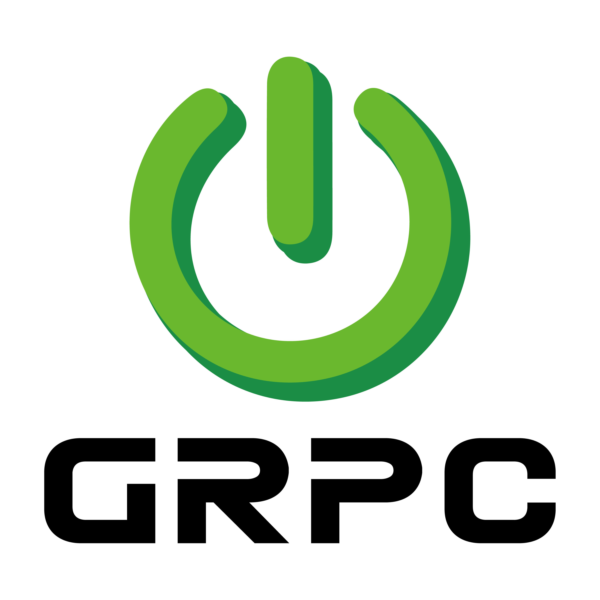

#  gRPC Starter [](https://github.com/DanielLiu1123/grpc-starter/actions) [](https://central.sonatype.com/artifact/io.github.danielliu1123/grpc-starter-dependencies) [](https://opensource.org/licenses/MIT)

[gRPC](https://grpc.io/) is a high-performance RPC framework that supports multiple languages, concise service definitions, and streaming. It is an ideal choice for building scalable and efficient microservice systems.

This project provides out-of-the-box, highly extensible Spring Boot starters for the gRPC ecosystem, making the integration of Spring Boot and gRPC seamless and native.

## Features

### Core:

- Dependency management for gRPC-related libraries
- gRPC server autoconfiguration
    - [Exception handling](https://danielliu1123.github.io/grpc-starter/docs/server/exception-handing)
    - [Health check](https://danielliu1123.github.io/grpc-starter/docs/server/autoconfiguration#health)
- gRPC client autoconfiguration
    - [`@Autowired` support](https://danielliu1123.github.io/grpc-starter/docs/client/autoconfiguration#inject-client)
    - [Dynamic refreshing](https://danielliu1123.github.io/grpc-starter/docs/client/dynamic-refresh)

### Extensions:

- [gRPC HTTP transcoding](https://danielliu1123.github.io/grpc-starter/docs/extensions/grpc-http-transcoding): Support both gRPC and HTTP/JSON with a single codebase.
- [Protobuf validation](https://danielliu1123.github.io/grpc-starter/docs/extensions/protobuf-validation): Protobuf message validation using [protovalidate](https://github.com/bufbuild/protovalidate-java) and [protoc-gen-validate](https://github.com/bufbuild/protoc-gen-validate).
- [Metrics](https://danielliu1123.github.io/grpc-starter/docs/extensions/metrics): Integrate Spring Boot Actuator with gRPC services.
- [Tracing](https://danielliu1123.github.io/grpc-starter/docs/extensions/tracing): Integrate Spring Boot Actuator with gRPC server and client.
- [Testing](https://danielliu1123.github.io/grpc-starter/docs/extensions/test): Integration with `SpringBootTest`.

## Quick Start

```groovy
implementation(platform("io.github.danielliu1123:grpc-starter-dependencies:<latest>"))
implementation("io.github.danielliu1123:grpc-boot-starter")
implementation("io.grpc:grpc-testing-proto")
```

```java
@SpringBootApplication
public class SimpleApp extends SimpleServiceGrpc.SimpleServiceImplBase {

    public static void main(String[] args) {
        new SpringApplicationBuilder(SimpleApp.class)
                .properties("grpc.client.base-packages=io.grpc")
                .properties("grpc.client.authority=127.0.0.1:9090")
                .run(args);
    }

    @Override
    public void unaryRpc(SimpleRequest request, StreamObserver<SimpleResponse> r) {
        var response = SimpleResponse.newBuilder()
                .setResponseMessage("Hello " + request.getRequestMessage())
                .build();
        r.onNext(response);
        r.onCompleted();
    }

    @Bean
    ApplicationRunner runner(SimpleServiceGrpc.SimpleServiceBlockingStub stub) {
        return args -> {
            var response = stub.unaryRpc(SimpleRequest.newBuilder().setRequestMessage("World!").build());
            System.out.println(response.getResponseMessage());
        };
    }

}
```

Refer to [quick-start](examples/quick-start).

## Documentation

Go to [Reference Documentation](https://danielliu1123.github.io/grpc-starter/docs/intro) for more information.

## Code of Conduct

This project is governed by the [Code of Conduct](./CODE_OF_CONDUCT.md).
By participating, you are expected to uphold this code of conduct.
Please report unacceptable behavior to llw599502537@gmail.com.

## Contributing

Use the [issue tracker](https://github.com/DanielLiu1123/grpc-starter/issues) for bug reports, feature requests, and submitting pull requests.

If you would like to contribute to the project, please refer to [Contributing](./CONTRIBUTING.md).

## License

The MIT License.
