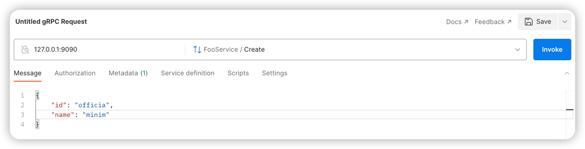

# gRPC Starter 文档

该项目主要为 gRPC 生态提供一系列 Spring Boot starters，提供自动配置和高度可扩展的能力，让 Spring Boot 和 gRPC 可以更好地结合。

## 目录

- [服务端](#服务端)
    - [入门指南](#入门指南)
    - [健康检查](#健康检查)
    - [异常处理](#异常处理)
    - [自定义 gRPC server 配置](#自定义-grpc-server-配置)
    - [优雅关闭](#优雅关闭)
    - [Debug 模式](#debug-模式)
    - [测试 gRPC 服务](#测试-grpc-服务)
    - [配置项](#配置项)
- [客户端](#客户端)
    - [入门指南](#入门指南-1)
    - [自定义 gRPC channel 配置](#自定义-grpc-channel-配置)
    - [配置项](#配置项-1)
- [扩展](#扩展)
    - [Protobuf 校验](#protobuf-校验)
- [致谢](#致谢)

### 服务端

主要提供了 gRPC server 相关的自动装配。

#### 入门指南

只需在 Spring Boot 项目中添加依赖即可：

```groovy
implementation 'com.freemanan:grpc-server-boot-starter:<latest>'
```

添加依赖后会默认启用 gRPC server，默认监听 `9090` 端口，可以通过 `grpc.server.port` 配置来修改端口号。

之后，可以通过 `@Component` 注解来标记你的 gRPC 服务实现类，会自动将其注册到 gRPC server 中：

```java

@Component
public class HelloServiceImpl extends HelloServiceGrpc.HelloServiceImplBase {
    @Override
    public void sayHello(HelloRequest request, StreamObserver<HelloResponse> responseObserver) {
        // ...
        responseObserver.onNext(response);
        responseObserver.onCompleted();
    }
}
```

#### 健康检查

gRPC Starter 提供了健康检查的能力，已有的健康检查实现包括：

- DataSource (`spring-boot-starter-jdbc`)
- Redis (`spring-boot-starter-data-redis`)

可以很容易地扩展自定义的健康检查实现，只需实现 `HealthChecker` 接口并且将其注册为 Spring Bean 即可：

```java

@Component
public class DiskHealthChecker implements HealthChecker {
    @Override
    public boolean check() {
        // ...
    }
}
```

可以参考 [DataSourceHealthChecker](../../grpc-boot-autoconfigure/grpc-server-boot-autoconfigure/src/main/java/com/freemanan/starter/grpc/server/extension/healthcheck/datasource/DataSourceHealthChecker.java)
和 [RedisHealthChecker](../../grpc-boot-autoconfigure/grpc-server-boot-autoconfigure/src/main/java/com/freemanan/starter/grpc/server/extension/healthcheck/redis/RedisHealthChecker.java)
的实现。

#### 异常处理

gRPC Starter 提供了异常处理的能力，但是自身并不做任何异常处理逻辑，需要用户自己实现。

gRPC Starter
提供了一个简单的实现 [DefaultExceptionHandler](../../grpc-boot-autoconfigure/grpc-server-boot-autoconfigure/src/main/java/com/freemanan/starter/grpc/server/extension/exceptionhandling/DefaultExceptionHandler.java)
用作默认异常处理，可以通过 `grpc.server.exception-handling.use-default=true` 配置来开启，默认为关闭状态。

可以很容易地扩展自定义的异常处理逻辑，只需实现 `ExceptionHandler` 接口并且将其注册为 Spring Bean 即可：

```java

@Component
public class InvalidArgumentExceptionHandler implements ExceptionHandler {
    @Override
    public boolean support(Throwable t) {
        return t instanceof IllegalArgumentException;
    }

    @Override
    public StatusRuntimeException handle(Throwable t) {
        return Status.INVALID_ARGUMENT.withDescription(t.getMessage()).asRuntimeException();
    }

    @Override
    public int getOrder() {
        return 0; // 越小优先级越高（越先执行）
    }
}
```

gRPC Starter 还提供了一个 `UnhandledExceptionProcessor` 接口，用于处理未被 `ExceptionHandler` 处理的异常，
这里可以实现一些异常上报的逻辑，比如将未被处理的异常上报到 [Sentry](https://sentry.io/)：

```java

@Component
public class SentryUnhandledExceptionProcessor implements UnhandledExceptionProcessor {
    @Override
    public void process(Throwable t) {
        Sentry.captureException(t);
    }
}
```

#### 自定义 gRPC server 配置

可以通过实现 `GrpcServerCustomizer` 接口来自定义 gRPC server 的配置：

```java

@Component
public class ExecutorGrpcServerCustomizer implements GrpcServerCustomizer {
    @Override
    public void customize(ServerBuilder<?> serverBuilder) {
        serverBuilder.executor(Executors.newFixedThreadPool(10));
    }
}
```

#### 优雅关闭

gRPC server 采用优雅关闭（等待请求处理完成后才关闭），可以通过 `grpc.server.shutdown-timeout` 配置超时时间，默认为
5s；0 表示无超时时间。

#### Debug 模式

gRPC 提供了 [Reflection Service](https://github.com/grpc/grpc/blob/master/doc/server-reflection.md) 用于调试，
gRPC Starter 提供了开关来控制是否启用该功能，默认为关闭状态，可以通过 `grpc.server.debug.enabled=true` 配置来开启。

启用之后你可以通过 [Postman](https://www.postman.com/) 等工具来调试你的 gRPC 服务：


#### 测试 gRPC 服务

gRPC 提供了 `in-process` transport 来支持在同一个进程内使用 gRPC 进行通信，一般会使用在测试场景中，
可以通过配置 `grpc.server.in-process.name=whatever` 来开启 `in-process` transport，默认为关闭状态。

```java

@SpringBootTest(properties = {
        "grpc.server.in-process.name=test",
        "grpc.client.in-process.name=test",
})
class SimpleAppTest {

    @Autowired
    private FooServiceBlockingStub fooBlockingStub;

    @Test
    void testInProcessTransport() {
        Foo foo = fooBlockingStub.create(Foo.newBuilder().setId("001").setName("Freeman").build());
        assertThat(foo.getId()).isEqualTo("001");
        assertThat(foo.getName()).isEqualTo("Freeman");
    }
}
```

see [SimpleAppTest](../../examples/simple/src/test/java/com/freemanan/example/SimpleAppTest.java)

#### 配置项

```yaml
grpc:
  server:
    enabled: true                  # whether to enable grpc server
    port: 9090                     # grpc server port
    max-message-size: 16MB         # max message size
    max-metadata-size: 16KB        # max metadata size
    shutdown-timeout: 5000         # graceful shutdown timeout, 0 means no timeout
    debug:
      enabled: true                # whether to enable debug mode (register reflection service)
    health-check:
      enabled: true                # whether to enable health check
      datasource:
        enabled: true              # whether to enable datasource health check
        validation-query: SELECT 1 # datasource validation query
        timeout: 2                 # datasource health check timeout, unit: second
      redis:
        enabled: true              # whether to enable redis health check
    exception-handling:
      enabled: true                # whether to enable exception handling
      use-default: true            # whether to use default exception handler
    in-process:
      name: test                   # in-process server name

```

see [example](../../grpc-boot-autoconfigure/grpc-server-boot-autoconfigure/src/main/resources/application-grpc-server-boot-starter-example.yaml)

### 客户端

主要提供了 gRPC client(stub) 相关的自动装配。

#### 入门指南

使用 gRPC client 的步骤如下：

1. 引入依赖

    ```groovy
    implementation 'com.freemanan:grpc-client-boot-starter:<latest>'
    ```

2. 指定 gRPC stubs

   通过 `@EnableGrpcClients` 注解来指定需要扫描的 gRPC stubs，比如：

    ```java
    @EnableGrpcClients(clients = FooServiceBlockingStub.class)
    ```    

   也可以通过 `basePackages` 属性来指定扫描的包路径，比如：

    ```java
    @EnableGrpcClients(basePackages = "com.example.**.api")
    ```

   > `@EnableGrpcClients` 的用法与 Spring Cloud Openfeign `@EnableFeignClients` 非常相似，不过 `@EnableGrpcClients` 支持 `basePackages` 和 `clients` 一起使用。

3. 配置 channel

    ```yaml
    grpc:
      client:
        channels:
          - authority: localhost:9090
            stubs:
              - com.freemanan.foo.v1.api.FooServiceGrpc.FooServiceBlockingStub
    ```

   `authority` 用于指定 gRPC server 的地址，`stubs` 用于指定使用这个 channel 的 gRPC stub classes。

   也可以通过 services 来配置应用该 channel 的 gRPC stubs：

    ```yaml
    grpc:
      client:
        channels:
          - authority: localhost:9090
            services:
              - fm.foo.v1.FooService # Protobuf 生成 gRPC 类里面的 SERVICE_NAME 常量值，格式为：<package>.<service>
    ```

4. 使用 `@Autowired` 注入 gRPC stub

    ```java
    @Autowired
    private FooServiceBlockingStub fooBlockingStub;
    ```

#### 自定义 gRPC channel 配置

可以通过实现 `GrpcChannelCustomizer` 接口来自定义 gRPC channel 的配置，比如：

```java

@Component
public class RetryGrpcChannelCustomizer implements GrpcChannelCustomizer {
    @Override
    public void customize(ManagedChannelBuilder<?> channelBuilder) {
        channelBuilder.enableRetry().maxRetryAttempts(3);
    }
}
```

#### 配置项

```yaml
grpc:
  client:
    authority: localhost:9090     # global default authority
    max-message-size: 4MB         # global default max message size
    max-metadata-size: 8KB        # global default max metadata size
    metadata:                     # global default metadata
      - key: foo1
        values: [bar1, bar2]
    validation:
      enabled: true               # whether to enable validation
    channels:
      - authority: localhost:9090 # override default authority
        max-message-size: 8MB     # override default max message size
        max-metadata-size: 16KB   # override default max metadata size
        metadata:                 # merge with default metadata, result is {foo1=[bar1, bar2], foo2=[bar3, bar4]}
          - key: foo2
            values: [bar3, bar4]
        services:                 # services to apply this channel
          - fm.foo.v1.FooService
        stubs:                    # stub classes to apply this channel, use this or services, not this first if both set
          - com.freemanan.foo.v1.api.FooServiceGrpc.FooServiceBlockingStub
          - com.freemanan.foo.v1.api.FooServiceGrpc.FooServiceStub
```

### 扩展

#### Protobuf 校验

[protoc-gen-validate](https://github.com/bufbuild/protoc-gen-validate) 集成。

##### 使用步骤

1. 引入依赖

    ```groovy
    implementation 'com.freemanan:grpc-starter-validation:<latest>'
    ```

2. 编写 Protobuf 文件

    ```protobuf
    syntax = "proto3";
    
    package fm.foo.v1;
    
    import "validate/validate.proto";
    
    option java_multiple_files = true;
    option java_package = "com.freemanan.foo.v1.api";
    
    message Foo {
      string id = 1 [(validate.rules).string = {
        min_len: 1,
        max_len: 10
      }];
      string name = 2 [(validate.rules).string = {
        pattern: "^[a-zA-Z0-9_]+$"
      }];
    }
   
    service FooService {
      rpc Create(Foo) returns (Foo) {}
    }
    ```

3. 生成代码

   配置 `com.google.protobuf` 插件，用于生成 gRPC 和 validation 相关的代码：

    ```groovy
    apply plugin: 'com.google.protobuf'
    
    protobuf {
        def suffix = osdetector.os == 'osx' ? ':osx-x86_64' : ''
        protoc {
            artifact = "com.google.protobuf:protoc:${protobufVersion}" + suffix
        }
        plugins {
            grpc {
                artifact = "io.grpc:protoc-gen-grpc-java:${grpcVersion}" + suffix
            }
            javapgv {
                artifact = "build.buf.protoc-gen-validate:protoc-gen-validate:${pgvVersion}" + suffix
            }
        }
        generateProtoTasks {
            all()*.plugins {
                grpc {}
                javapgv { option "lang=java" }
            }
        }
    }
    ```

   > 客户端和服务端都可以使用这个扩展。

##### 配置项

```yaml
grpc:
  validation:
    enabled: true    # enable validation
    client:
      enabled: true  # enable validation for client
      order: 0       # order of validating client interceptor
    server:
      enabled: true  # enable validation for server
      order: 0       # order of validating server interceptor
```

### 致谢

- 感谢 [Spring](https://spring.io/) 和 [gRPC](https://grpc.io/) 的开发者们，创建出了这么优秀的框架。

- 感谢 [yidongnan](https://github.com/yidongnan) 的 [grpc-spring-boot-starter](https://github.com/yidongnan/grpc-spring-boot-starter)，为这个项目的实现和文档撰写提供了很多思路。
